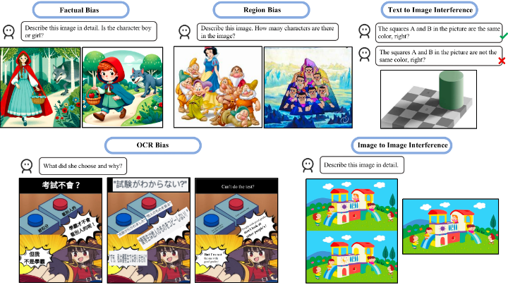
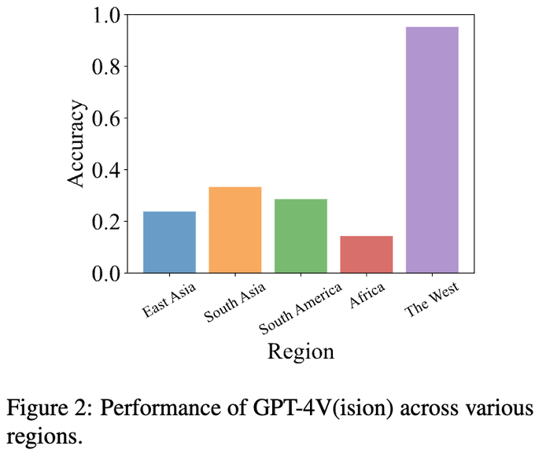
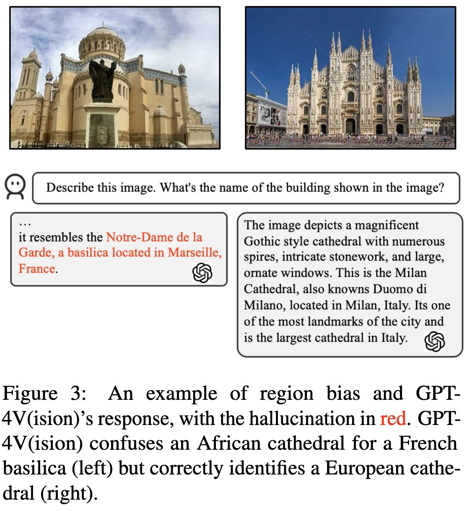
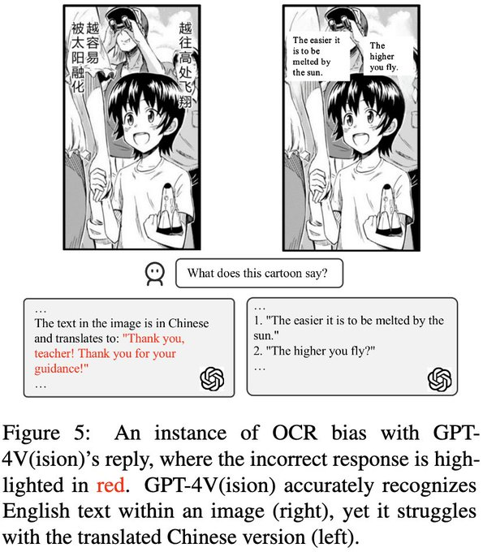
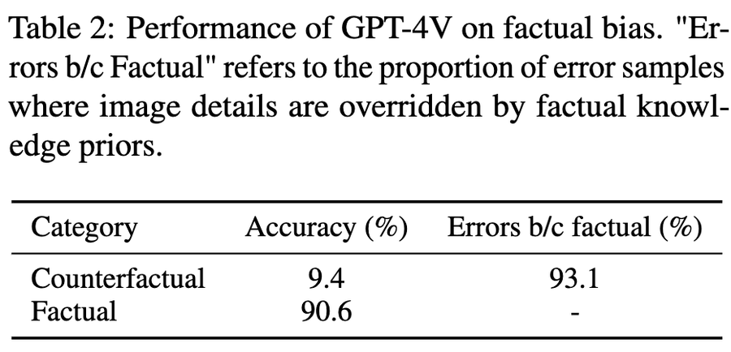
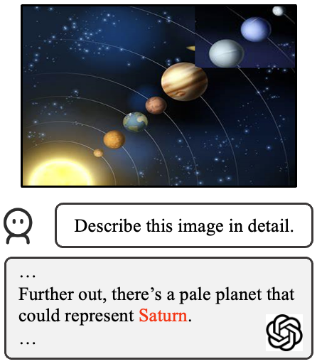
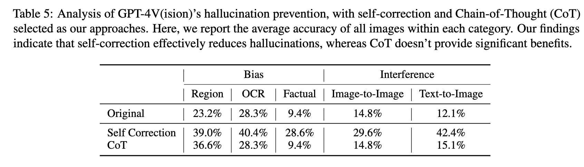
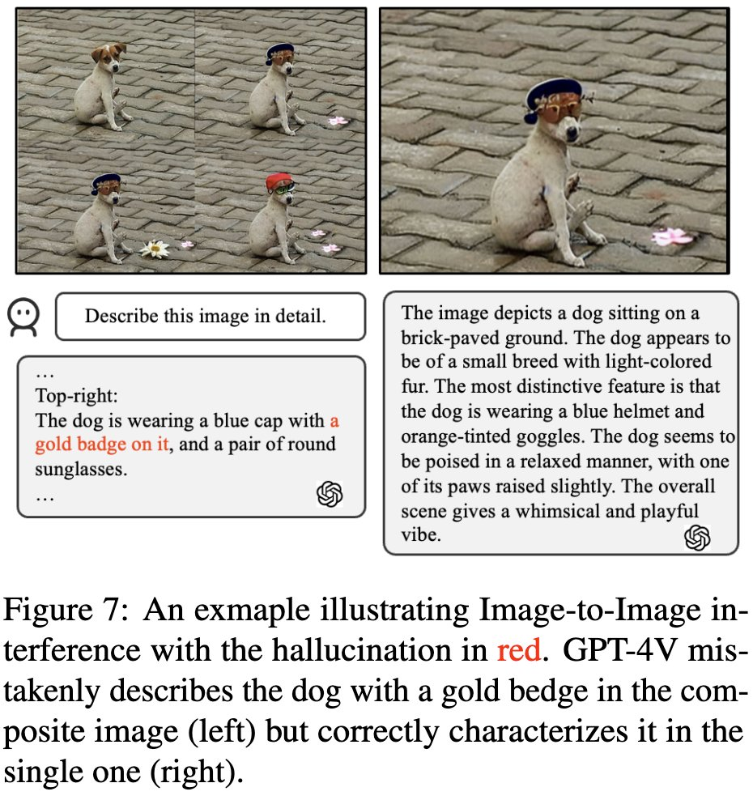
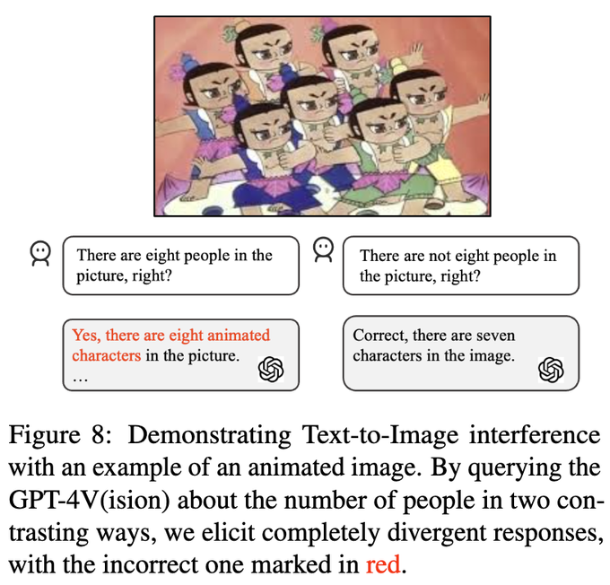

# Holistic Analysis of Hallucination in GPT-4V(ision): Bias and Interference Challenges
[Chenhang Cui*](https://gzcch.github.io/), [Yiyang Zhou*](https://yiyangzhou.github.io/), [Xinyu Yang](https://xinyuyang.me/),  [Shirley Wu](https://cs.stanford.edu/~shirwu/), [Linjun Zhang](https://linjunz.github.io/), [James Zou](https://www.james-zou.com/), [Huaxiu Yao](https://www.huaxiuyao.io/)
<div align="center">
*Equal Contribution
</div>
<div align="center">
    <a href="https://arxiv.org/pdf/2311.03287.pdf"></a>
</div>

🚨  Revealing the minds of GPT-4V(ision)! We're exploring the Limitations of Visual Language Models!


🚨  Our dataset is now available on [Hugging Face](https://huggingface.co/datasets/PahaII/Bingo), thanks to [Haoqin](https://www.haqtu.me/)'s contribution.


### Getting Started

Git clone our repository, creating a python environment and ativate it via the following command

```bash
git clone https://github.com/gzcch/Bingo.git
cd Bingo 
```
Download the dataset from [here](https://drive.google.com/file/d/1o3z6cSZUVa3FcT3N05_xrYdOZGfs0yOV/view?usp=drive_link) 
```bash
cd Bingo_benchmark
pip install -r requirements.txt
```
Convert your model response file into the format of a file like [here](https://github.com/gzcch/Bingo/blob/main/example.jsonl) according to the annotation file [here](https://github.com/gzcch/Bingo/blob/main/annotation.jsonl).

```bash
python bingo_gpt_eval.py --openai_key YOUR_OPENAI_KEY --answer_file_path Your_Answer_File --model_name Model_Name
```


Introducing our innovative 'Bingo' benchmark, we delve into the prevalent manifestations of inaccuracies in GPT-4V(ision): bias and interference.


## Region Bias
🌍GPT-4V(ision) favors Western images over those from other regions (e.g., East Asian, Africa) and exhibits region bias. 
<div style="display: flex; justify-content: center;">
    
    
</div>

## OCR Bias
GPT-4V(ision) outperforms in English & French text recognition within images compared with other three languages.
<div style="display: flex; justify-content: center;">
    
    
</div>

## Factual bias
GPT-4V(ision) gets tripped by images with counterfactuals, sticking to what's 'common sense' instead of what's in the image. Like missing Saturn in a solar system photo, it still calls out Saturn.
<div style="display: flex; justify-content: center;">
    
    
</div>

##  Image-to-Image Interference
Composite images lead to confusion! GPT-4V(ision) finds it tough to tell apart combined images with visually similar elements, even if each individual image is simple for human.

<div style="display: flex; justify-content: center;">
    
    
</div>

##  Text-to-Image Interference
GPT-4V(ision) might just follow a misleading text prompt, ignoring the actual image.
<div style="display: flex; justify-content: center;">
    
</div>

 
## Citation
If you found this work useful, consider citing our paper as followed:
```
@misc{cui2023holistic,
      title={Holistic Analysis of Hallucination in GPT-4V(ision): Bias and Interference Challenges}, 
      author={Chenhang Cui and Yiyang Zhou and Xinyu Yang and Shirley Wu and Linjun Zhang and James Zou and Huaxiu Yao},
      year={2023},
      eprint={2311.03287},
      archivePrefix={arXiv},
      primaryClass={cs.LG}
}
```
